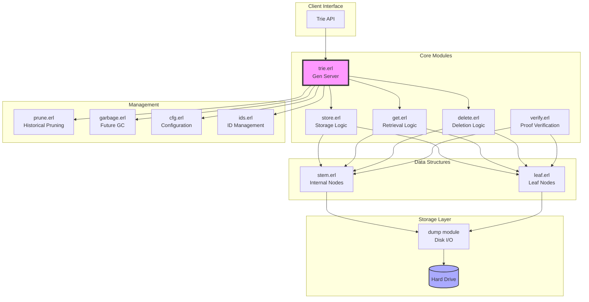
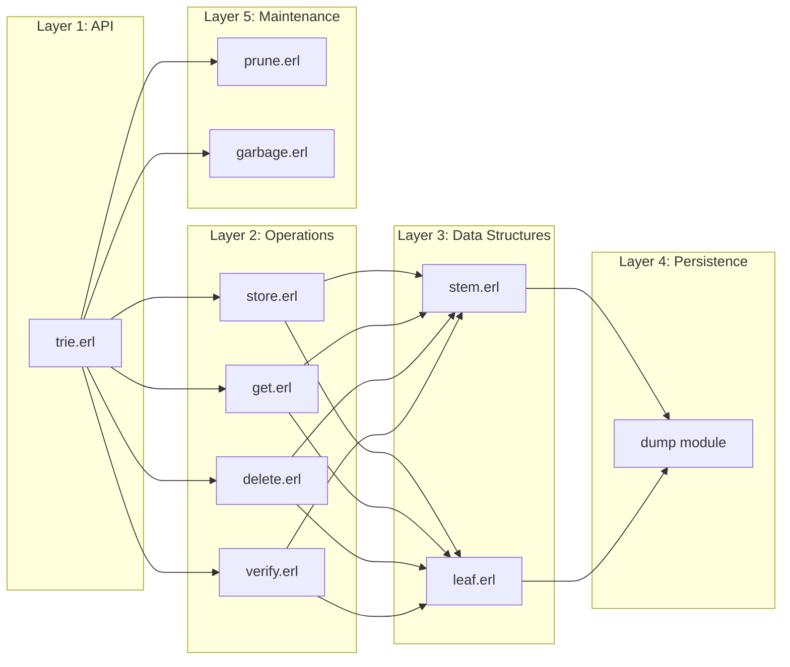
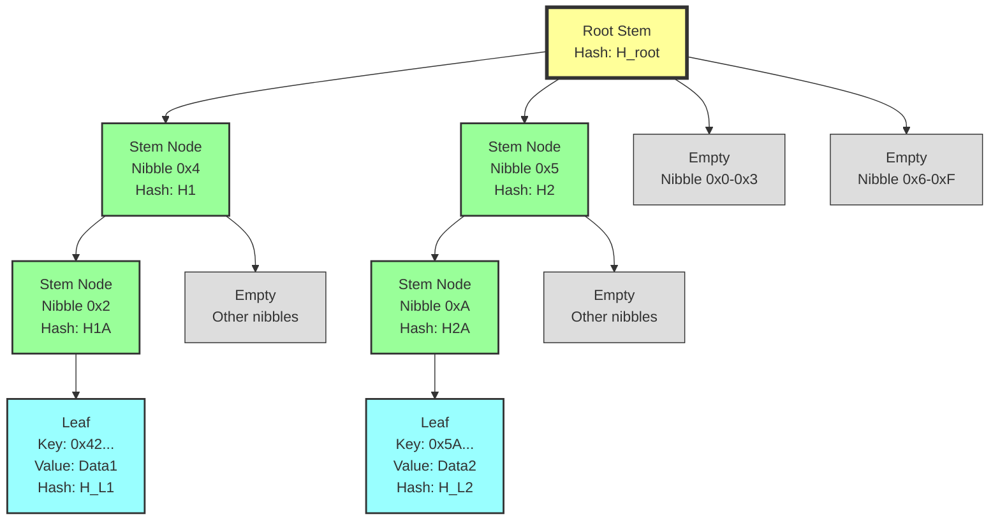
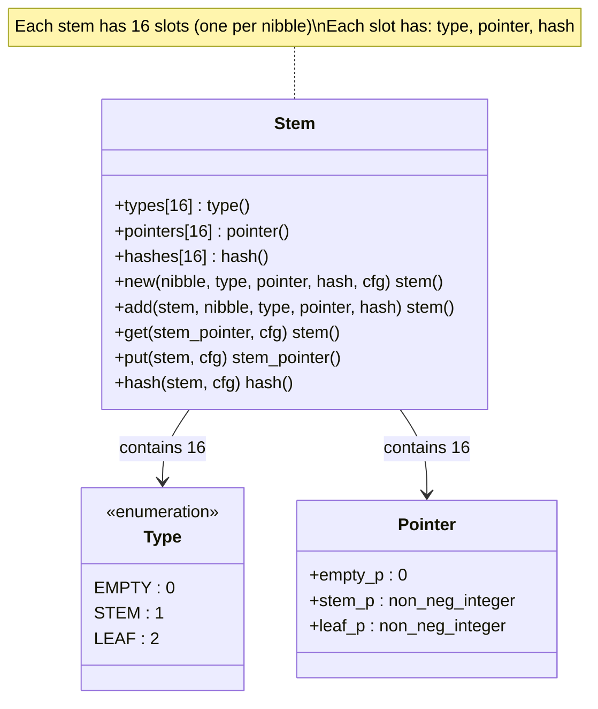
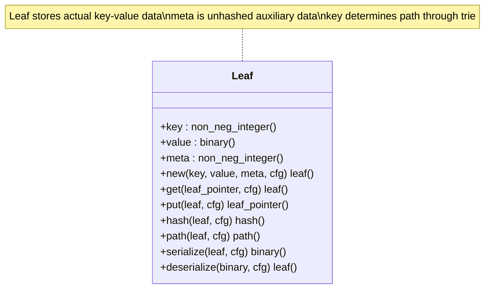
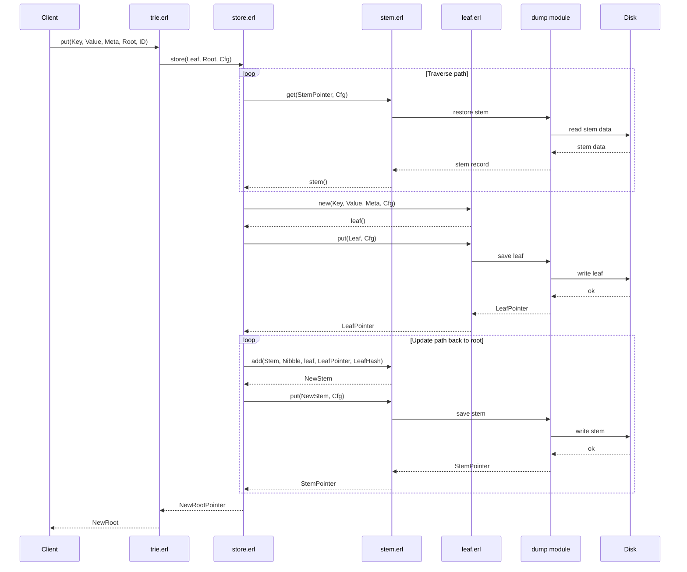
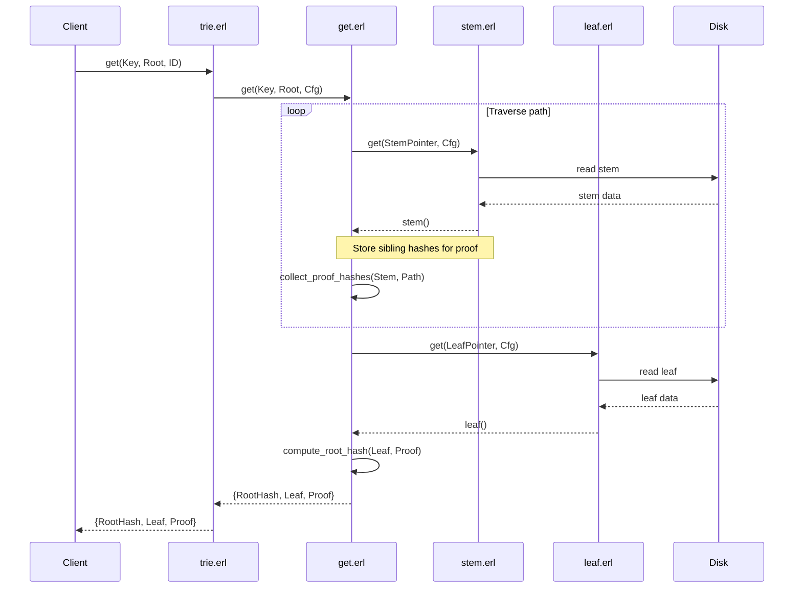
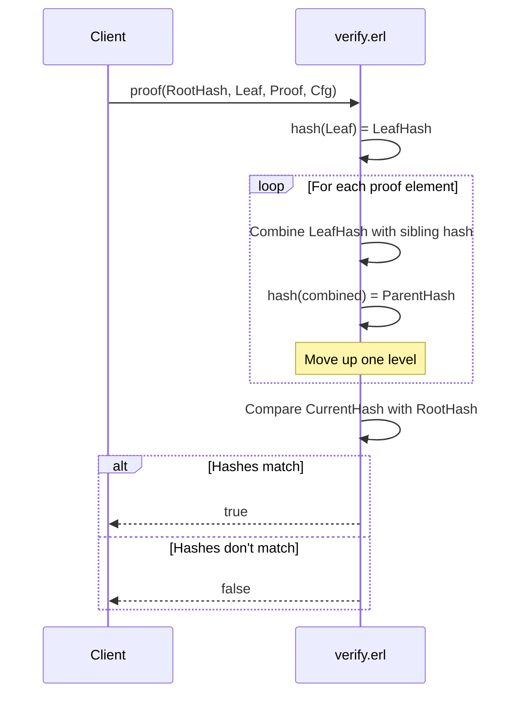
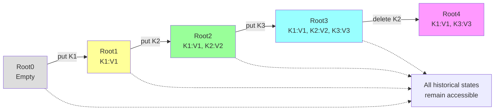
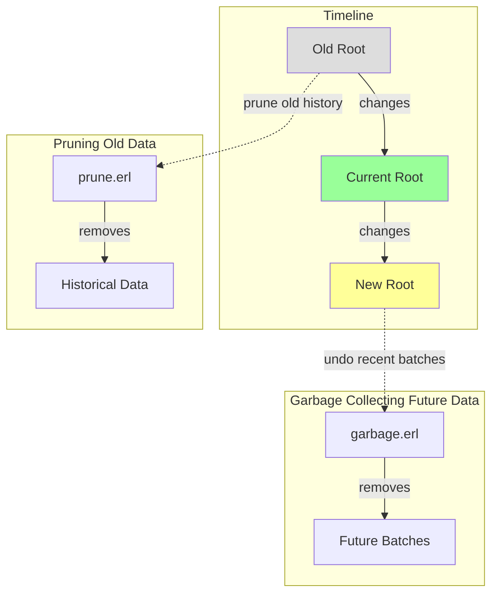

# MerkleTrie

[](https://github.com/your-repo/MerkleTrie/actions)
[](LICENSE)

A persistent, append-only **Merkle Trie** implementation in Erlang for efficient versioned state management with cryptographic proof capabilities.

This is a **sparse Merkle trie** database that can prove both the existence and non-existence of data. It implements an **order-16 radix tree** where every node has 16 children (one per hexadecimal nibble). The tree can be configured to use either RAM or hard drive for storage.

## Table of Contents
- [Features](#features)
- [Quick Start](#quick-start)
- [Architecture](#architecture)
- [Data Structures](#data-structures)
- [Operations](#operations)
- [Installation](#installation)
- [Usage](#usage)
- [Testing](#testing)
- [Development](#development)
- [Infrastructure](#infrastructure)
- [Advanced Features](#advanced-features)
- [Performance](#performance)
- [Production Deployment](#production-deployment)

## Features

The goal of this project is to provide:

1. **Merkle tree database on disk** - Persistent storage with cryptographic proofs
2. **Deterministic root hash** - Root hash is deterministically derived from contents; order of insertion/deletion doesn't matter
3. **Historical state queries** - Look up the state at any point in history
4. **Append-only immutable datastructure** - No destructive updates, perfect for consensus-critical applications
5. **Proof system** - Cryptographic proofs for data existence/non-existence
6. **Efficient batch operations** - Optimized bulk insertions and updates

## Quick Start

### Using Make (Recommended)

```bash
# Automated setup (downloads dependencies, compiles, tests)
make bare-metal

# Start interactive shell
make shell

# Run tests
make test

# View all available commands
make help
```

### Using Docker

```bash
# Development environment
docker-compose --profile dev up -d
docker-compose exec trie-dev /bin/bash

# Production deployment
docker-compose up -d

# Run tests in container
docker-compose --profile test run --rm trie-test
```

### Traditional Method

```bash
# First, ensure Erlang/OTP 25+ is installed
# Download and compile
./rebar3 compile

# Run the software
sh start.sh
```

## Architecture

### System Components



### Module Responsibilities



### Core Modules

- **trie.erl** - Main trie gen_server
- **store.erl** - Storage and proof generation
- **stem.erl** - Tree node structure (16-ary branching)
- **leaf.erl** - Leaf node structure
- **verify.erl** - Merkle proof verification
- **prune.erl** - Historical data pruning

## Data Structures

### Merkle Trie Structure



MerkleTrie uses a 16-ary tree structure where:
- Each stem node has 16 child pointers (one per hex nibble)
- Paths are determined by key bits
- Leaves contain actual key-value data
- All data is cryptographically hashed

### Stem Node Structure



### Leaf Node Structure



## Operations

### Put Operation Flow



### Get Operation with Proof Generation



### Proof Verification



## Installation

### Prerequisites

- **Erlang/OTP 25.3+** (27.1 recommended)
- **Rebar3** (automatically downloaded by Makefile)
- **Git**

### Automated Setup

For bare metal deployment with full environment setup:

```bash
chmod +x scripts/bare-metal-setup.sh
./scripts/bare-metal-setup.sh
```

This script will:
- Detect your OS and install Erlang/OTP
- Install Rebar3
- Fetch dependencies
- Compile the project
- Run tests and smoke tests
- Optionally set up systemd service

Supported platforms: Ubuntu, Debian, Fedora, RHEL, CentOS, Arch Linux, macOS

### Manual Installation

See [INFRASTRUCTURE.md](INFRASTRUCTURE.md#bare-metal-deployment) for detailed manual installation instructions.

## Usage

For detailed usage examples, see [src/test_trie.erl](src/test_trie.erl).

### Basic Operations

```erlang
% Start the trie
Id = my_trie,
Cfg = cfg:new(Id, 8, 32, 0, 12, hd),
trie_sup:start_link(Cfg),

% PUT a value
Key = <<1,2,3,4,5,6,7,8>>,
Value = <<100,101,102,103>>,
trie:put(Key, Value, 1, 1, Id),

% GET a value with proof
{RootHash, Leaf, Proof} = trie:get(Key, 1, Id),

% Verify the proof
verify:leaf(RootHash, Key, Leaf, Proof),

% DELETE a value
trie:delete(Key, 2, Id),

% Compute root hash
RootHash = trie:root_hash(1, Id).
```

### Batch Operations

```erlang
% Batch PUT
KVList = [{<<1,0,0,0,0,0,0,0>>, <<1:32>>},
          {<<2,0,0,0,0,0,0,0>>, <<2:32>>},
          {<<3,0,0,0,0,0,0,0>>, <<3:32>>}],
trie:put_batch(KVList, 1, Id).
```

### Historical Queries



## Testing

### Quick Test

```bash
make test              # All tests
make eunit             # Unit tests only
make proper            # Property-based tests
make smoke-test        # Smoke tests
```

### Comprehensive Testing

```bash
make ci                # Full CI pipeline locally
make coverage          # Generate coverage report
make load-test         # Performance benchmarking
```

### Test Organization

- `test/trie_tests.erl` - EUnit integration tests
- `test/smoke_tests.erl` - Comprehensive smoke tests (15 scenarios)
- `test/prop_*.erl` - Property-based tests (PropEr)

## Development

### Build Commands

```bash
make compile           # Compile project
make clean             # Clean build artifacts
make deps              # Fetch dependencies
make shell             # Start Erlang REPL
make release           # Build production release
```

### Code Quality

```bash
make check             # Run all static analysis
make dialyzer          # Type checking
make xref              # Cross-reference analysis
make format            # Format code
```

### Git Hooks

Install pre-commit hooks for automatic quality checks:

```bash
./scripts/install-hooks.sh
```

## Infrastructure

This project includes comprehensive build, test, and deployment infrastructure:

- **GitHub Actions CI/CD** - Automated testing on multiple OTP versions (25.3, 26.2, 27.1)
- **Docker/Docker Compose** - Containerized development and deployment
- **Makefile** - Standardized build commands (40+ targets)
- **Smoke Tests** - Comprehensive validation suite
- **Load Testing** - basho_bench integration
- **Security Scanning** - Automated vulnerability detection (Trivy)

For complete infrastructure documentation, see [INFRASTRUCTURE.md](INFRASTRUCTURE.md).

For technology stack and library references (as of 2025-11-15), see [BIBLIOGRAPHY.md](BIBLIOGRAPHY.md).

## Advanced Features

### Garbage Collection and Pruning



- **Prune (`prune.erl`)** - Remove old historical data to save space
- **Garbage Collection (`garbage.erl`)** - Undo recent batches (rollback functionality)
- Both operations maintain trie integrity and deterministic hashing

### Configuration Options

```erlang
% cfg:new(ID, KeyLength, ValueSize, MetaSize, HashSize, Mode)
Cfg = cfg:new(my_trie, 8, 32, 0, 12, hd).
```

- **KeyLength** - Path depth in bytes (determines maximum keys)
- **ValueSize** - Leaf value size in bytes
- **MetaSize** - Unhashed metadata size
- **HashSize** - Hash function output size (12-32 bytes)
- **Mode** - Storage mode: `hd` (hard drive) or `ram` (in-memory)

## Performance

Typical performance on modern hardware:
- **PUT operations:** ~10,000-50,000 ops/sec
- **GET operations:** ~20,000-100,000 ops/sec
- **Root hash computation:** ~1,000-5,000 ops/sec
- **Batch operations:** ~500-2,000 batches/sec (100 items each)

Run benchmarks: `make load-test`

## Production Deployment

### Build Release

```bash
make release
```

### Deploy

```bash
# Copy to production server
scp -r _build/prod/rel/trie/ user@server:/opt/trie/

# On server, start the service
cd /opt/trie
./bin/trie start
./bin/trie ping
```

### Docker Deployment

```bash
# Build image
docker build -t merkletrie:latest .

# Run production container
docker run -d \
  -p 8080:8080 \
  -v merkletrie-data:/opt/trie/data \
  --name merkletrie \
  merkletrie:latest
```

## Real-World Usage

MerkleTrie is used in production by:
- [Amoveo](https://github.com/zack-bitcoin/amoveo) - Blockchain implementation

## Documentation

- [INFRASTRUCTURE.md](INFRASTRUCTURE.md) - Complete infrastructure guide
- [BIBLIOGRAPHY.md](BIBLIOGRAPHY.md) - Technology stack (2025-11-15)
- [docs/todo.md](docs/todo.md) - Known issues and roadmap
- [docs/hashdepth.md](docs/hashdepth.md) - Hash collision analysis
- [src/test_trie.erl](src/test_trie.erl) - Usage examples

## Contributing

1. Fork the repository
2. Create a feature branch
3. Make your changes
4. Install git hooks: `./scripts/install-hooks.sh`
5. Run tests: `make test`
6. Submit a pull request

## System Requirements

**Minimum:**
- Erlang/OTP 25.3+
- 2 GB RAM
- 1 GB disk space

**Recommended:**
- Erlang/OTP 27.1+
- 4+ GB RAM
- 10+ GB disk space
- Multi-core CPU

## License

See LICENSE file for details.

## Support

- **Issues:** [GitHub Issues](https://github.com/your-repo/MerkleTrie/issues)
- **Documentation:** See `docs/` directory
- **Examples:** See `src/test_trie.erl`

## Acknowledgments

Built with:
- [Erlang/OTP](https://www.erlang.org/)
- [Rebar3](https://rebar3.org/)
- [PropEr](https://proper-testing.github.io/)
- [basho_bench](https://github.com/basho/basho_bench)
