# Merkle Trie

A persistent, append-only Merkle Trie implementation in Erlang for efficient versioned state management with cryptographic proof capabilities.

This is a **sparse Merkle trie** database that can prove both the existence and non-existence of data. It implements an **order-16 radix tree** where every node has 16 children (one per hexadecimal nibble). The tree can be configured to use either RAM or hard drive for storage.

## Table of Contents
- [Overview](#overview)
- [Architecture](#architecture)
- [Data Structures](#data-structures)
- [Operations](#operations)
- [Installation](#installation)
- [Usage](#usage)
- [Advanced Features](#advanced-features)

## Overview

The MerkleTrie project provides:

1. **Persistent storage** - Merkle tree database stored on hard drive
2. **Deterministic hashing** - Root hash is deterministically derived from contents (insertion/deletion order doesn't matter)
3. **Historical lookups** - Query state at any point in history
4. **Immutability** - Append-only immutable data structure
5. **Proof system** - Cryptographic proofs for data existence/non-existence
6. **Efficient batch operations** - Optimized bulk insertions and updates

## Architecture

### System Components

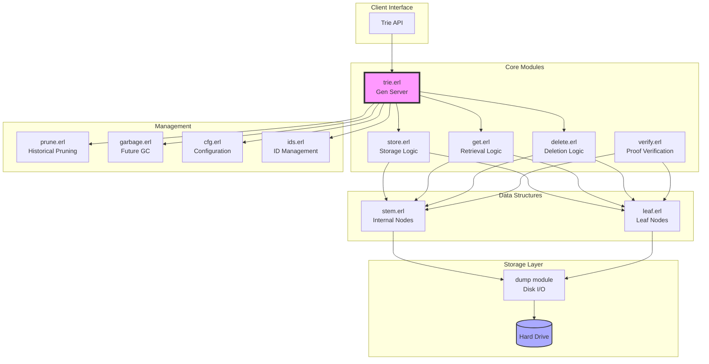

### Module Responsibilities

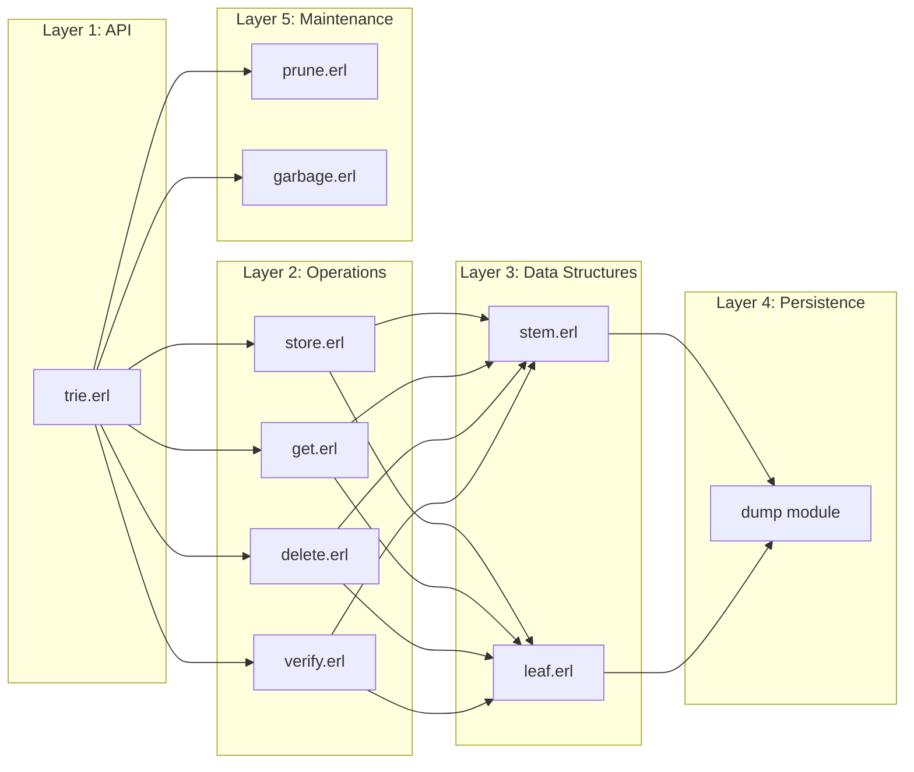

## Data Structures

### Merkle Trie Structure

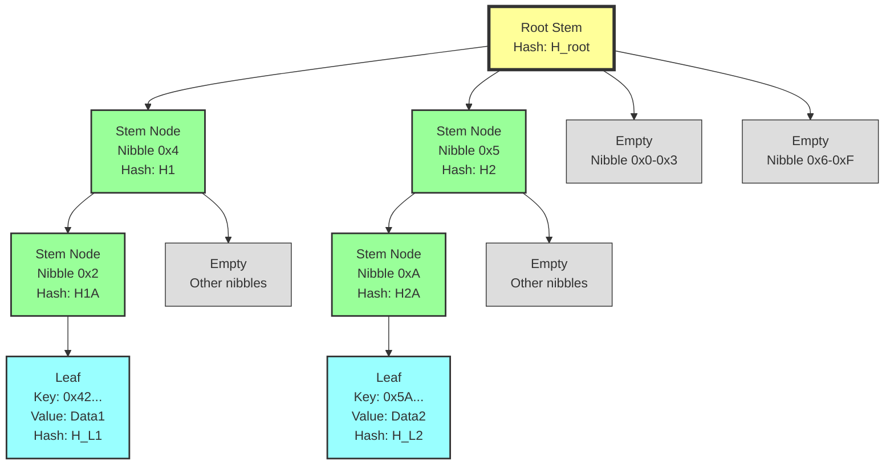

### Stem Node Structure

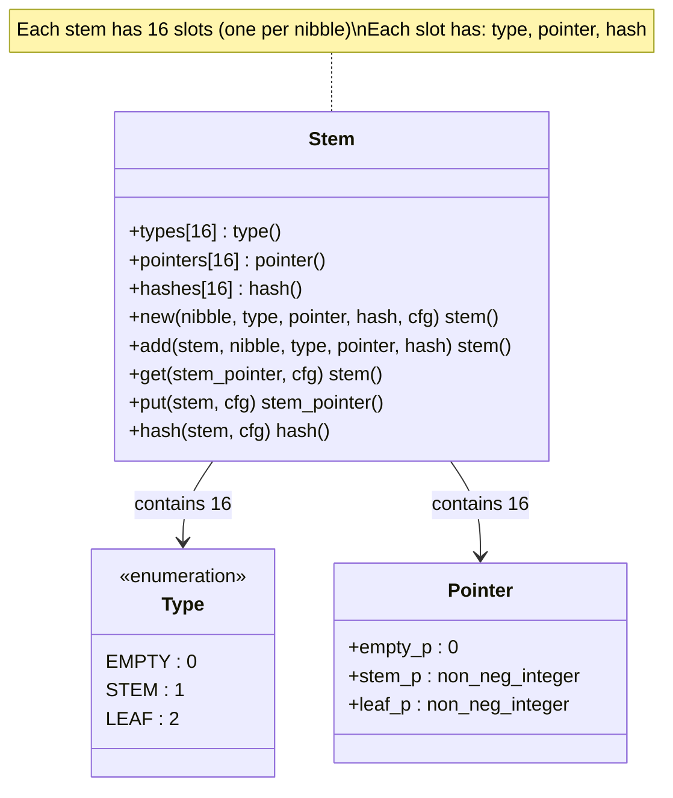

### Leaf Node Structure

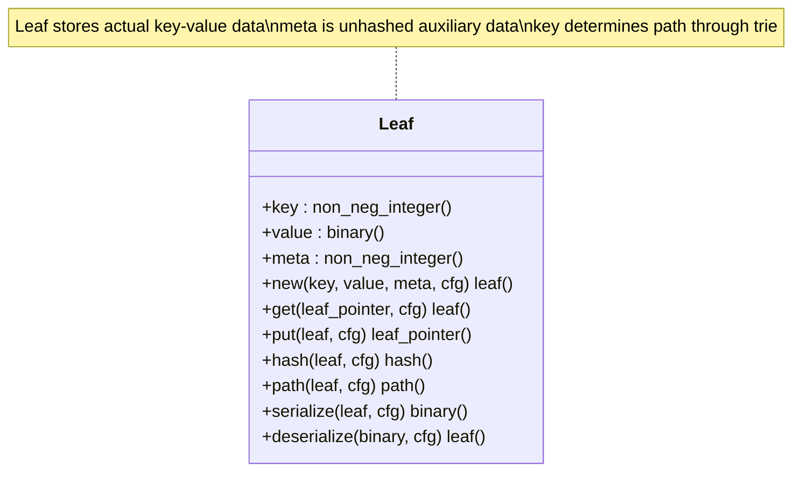

## Operations

### Put Operation Flow

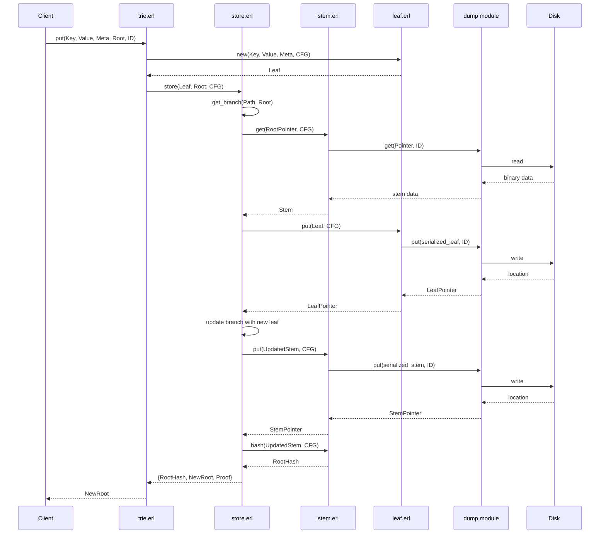

### Get Operation Flow

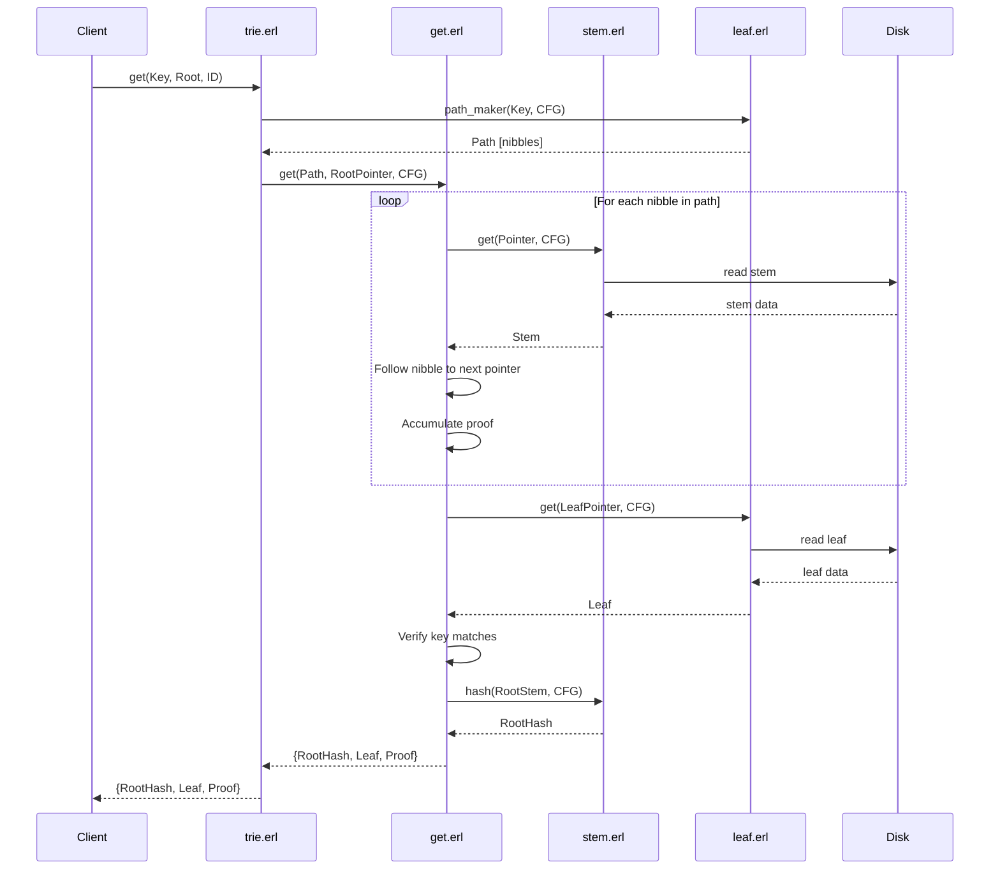

### Delete Operation Flow

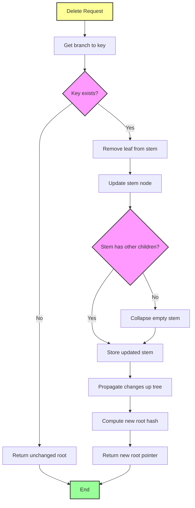

### Batch Operation Flow

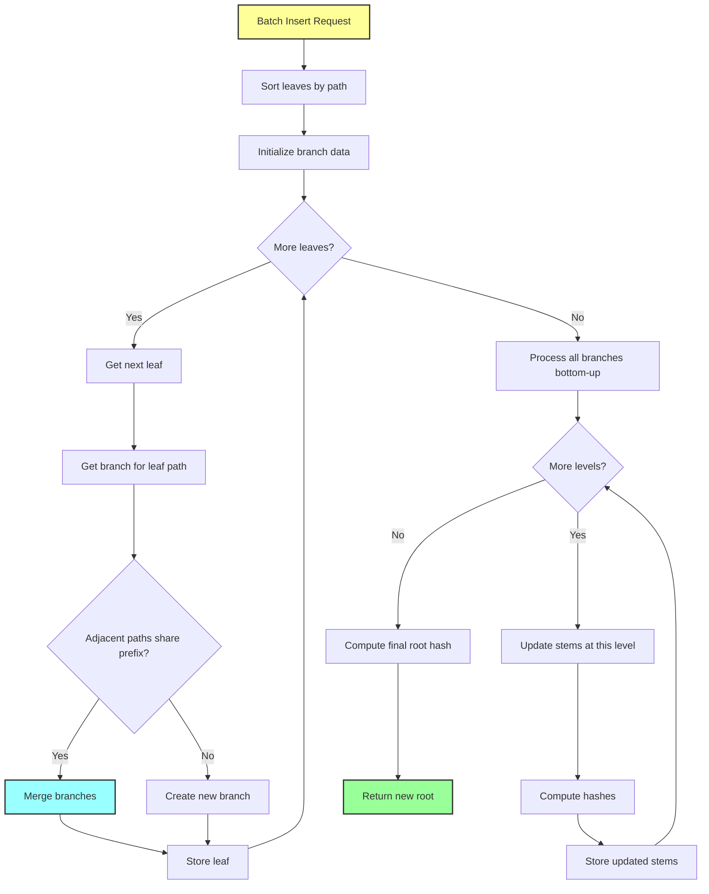

### Proof Verification Flow

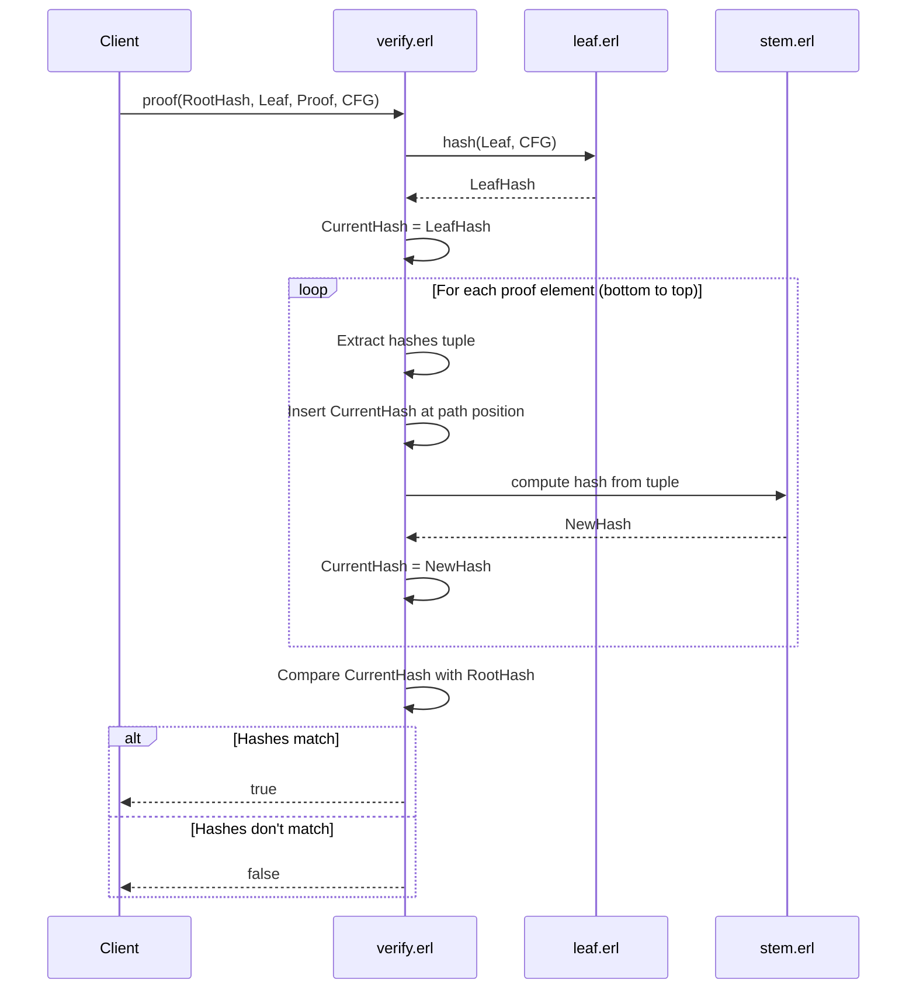

## Installation

### Prerequisites

First you need Erlang installed.

### Running

To start the software:

```bash
sh start.sh
```

## Usage

For detailed usage examples, see [test_trie.erl](src/test_trie.erl).

### Basic Operations

```erlang
% Start the trie
ID = trie01,
CFG = trie:cfg(ID),

% Initialize root
Root0 = 1,

% Put a value
Key = 5,
Value = <<2,3>>,
Meta = 0,
Root1 = trie:put(Key, Value, Meta, Root0, ID),

% Get a value
{RootHash, Leaf, Proof} = trie:get(Key, Root1, ID),
Value = leaf:value(Leaf),

% Verify proof
true = verify:proof(RootHash, Leaf, Proof, CFG),

% Delete a value
Root2 = trie:delete(Key, Root1, ID),

% Batch insert
Leaves = [leaf:new(1, <<1,1>>, 0, CFG),
          leaf:new(2, <<2,2>>, 0, CFG),
          leaf:new(3, <<3,3>>, 0, CFG)],
Root3 = trie:put_batch(Leaves, Root0, ID),

% Get all leaves
AllLeaves = trie:get_all(Root3, ID).
```

### Historical Queries

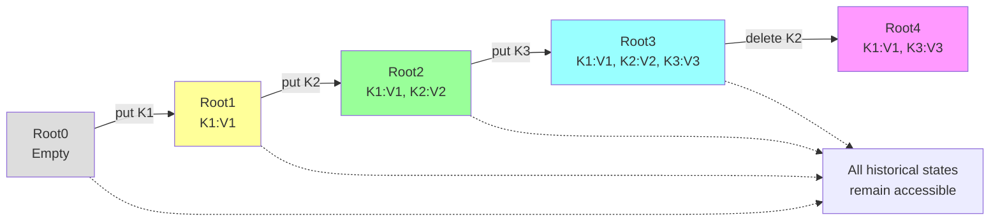

## Advanced Features

### Garbage Collection and Pruning

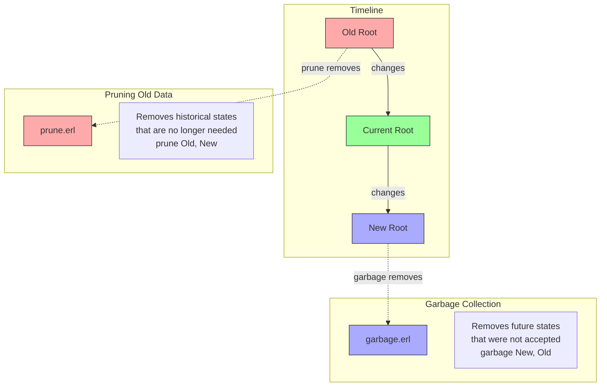

### State Restoration

When you garbage collect leaves from the trie, you can later restore them using proofs:

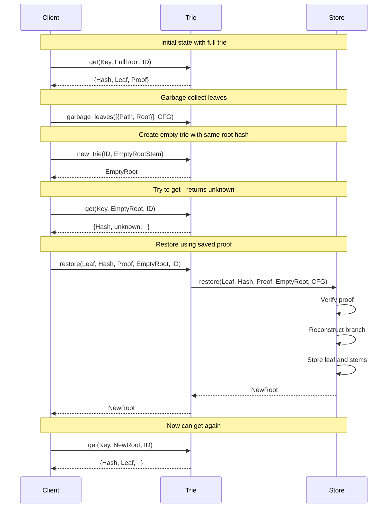

### Sparse Merkle Trie - Proof of Non-Existence

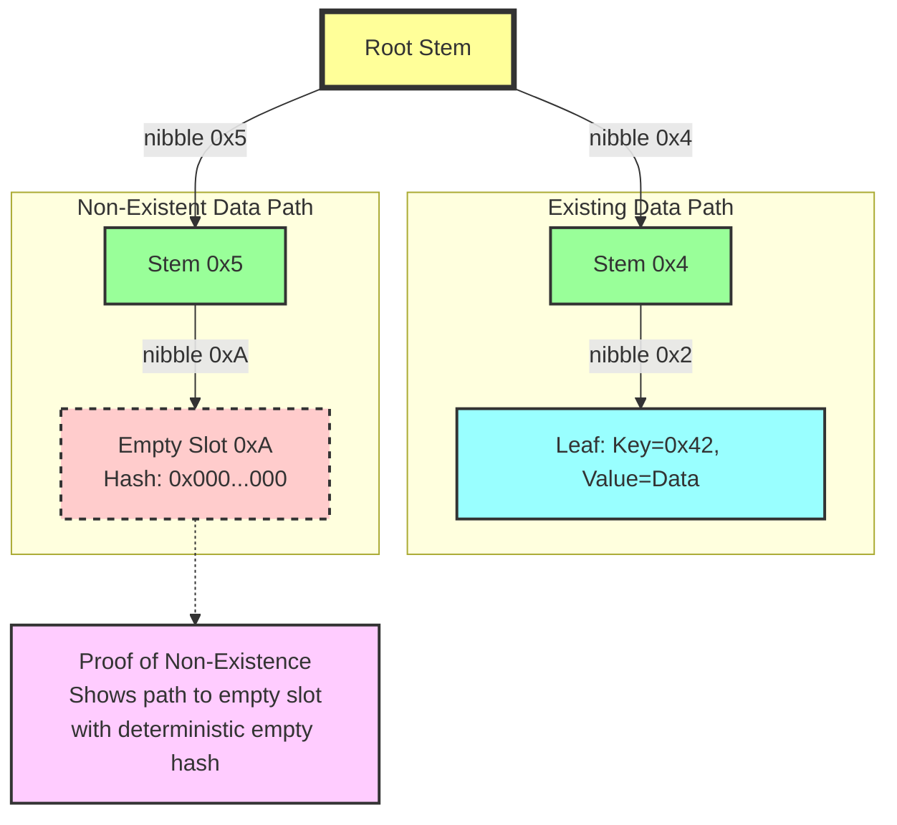

### Proof System Benefits

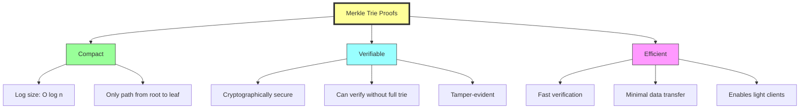

## Real-World Usage

This MerkleTrie is used in production by:
- [Amoveo](https://github.com/zack-bitcoin/amoveo) - A blockchain project

## Key Properties

1. **Deterministic**: Same data always produces same root hash regardless of insertion order
2. **Persistent**: All historical states remain accessible
3. **Provable**: Can generate and verify cryptographic proofs
4. **Efficient**: Logarithmic complexity for operations
5. **Append-only**: Immutable structure enables safe concurrent reads

## Technical Details

### Radix Tree Structure
- **Order-16 radix tree**: Each stem node has exactly 16 children (one per nibble value 0x0 through 0xF)
- **Nibble-based navigation**: Keys are decomposed into 4-bit nibbles for tree traversal
- **Configurable storage**: Can use RAM or hard drive storage backends

### Sparse Merkle Trie
This implementation is a **sparse Merkle trie**, which means:
- **Proof of non-existence**: Can cryptographically prove that data does NOT exist in the trie
- **Empty nodes optimized**: Empty branches are represented efficiently without storing actual nodes
- **Complete key space**: Conceptually covers the entire key space, even for keys never inserted
- **Deterministic empty hash**: Empty positions have a consistent, predetermined hash value

### Path Encoding
- Keys are converted to paths of nibbles (4-bit values)
- Each nibble determines which of 16 children to follow in a stem node
- Path length determined by configuration (typically 5-10 nibbles for 20-40 bit keys)

### Hash Computation
- **Leaf hash**: `hash(key || value)`
- **Stem hash**: `hash(concatenation of 16 child hashes)`
- **Empty hash**: Predefined zero value for empty positions
- **Root hash**: Uniquely identifies entire trie state

### Storage Format
- Stems and leaves stored separately on disk
- Pointers reference disk locations (append-only structure)
- Configurable sizes for keys, values, hashes, and metadata
- Each stem stores: 16 types, 16 pointers, 16 hashes
